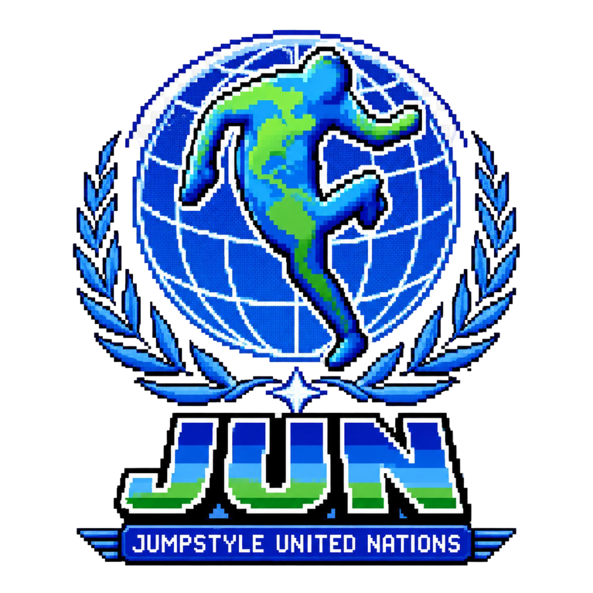

<p align="center">
  
</p>

<h1 align="center">Jumpstyle United Nations</h1>

<p align="center"><strong>The world's largest open Jumpstyle museum.</strong></p>

<p align="center">
  <a href="https://jumpstyle.com.br/JUN/"></a>
  <a href="JumpstyleTimeline/Global/global-timeline.md"></a>
  <a href="data/country-research.json"></a>
  <a href="LICENSE"></a>
  <a href="https://github.com/Mreaggle/JumpstyleUnitedNations/commits/main"></a>
  <a href="CONTRIBUTING.md"></a>
</p>

JUN is a community-maintained archive of Jumpstyle dance, music, people, meetings, leagues, forums and national scenes. Its purpose is to preserve evidence, connect perspectives across countries and make the history understandable to future jumpers, researchers and software agents.

> **Data maturity notice:** the global timeline is actively curated, but several national timeline files still contain legacy templates. A placeholder is not historical evidence. Check the [research status](docs/RESEARCH_STATUS.md) and [country registry](data/country-research.json) before reusing a claim.

## Start here

| Area | Purpose | Status |
| --- | --- | --- |
| [Global Timeline](JumpstyleTimeline/Global/global-timeline.md) | Chronological, sourced milestones across countries | Active curation |
| [National Timelines](JumpstyleTimeline/) | Country-specific perspectives, synchronized global records and local research | Mixed maturity |
| [Key Figures Worldwide](JUNToolkit/KeyFiguresWorldwide/Dance/README.md) | Community index of influential jumpers | Community review |
| [Jumpstyle Archive](JumpstyleArchive/) | Forums, media, competitions, voices and knowledge | In development |
| [Community Mapping](CommunityMapping/) | Active and historical national communities | In development |
| [Research Status](docs/RESEARCH_STATUS.md) | Completed work, gaps and next extraction passes | Maintained |
| [Country Research](docs/COUNTRY_RESEARCH.md) | Multilingual terms and evidence targets by country | Maintained |
| [Repository Audit](docs/REPOSITORY_AUDIT.md) | Known structural debt and migration priorities | Maintained |
| [Contribution Guide](CONTRIBUTING.md) | How to submit evidence without weakening the archive | Maintained |

## Repository map

```text
.
|-- JumpstyleTimeline/       Global and national historical records
|-- JumpstyleArchive/        Media, forums, competitions and knowledge areas
|-- JUNToolkit/              Research tools and Key Figures Worldwide
|-- CommunityMapping/        Community and country structures
|-- JumpstyleFrameworks/     Governance and shared standards
|-- DigitalJumpstylePlatform/ Platform concepts and trend projects
|-- HowTo/                   Legacy contributor tutorials
|-- data/                    Machine-readable research registries
|-- docs/                    Architecture, policy, status and archived material
|-- scripts/                 Repository validation
|-- AGENTS.md                Operating rules for AI and automation agents
`-- CONTRIBUTING.md          Human contribution workflow
```

See [Repository Architecture](docs/ARCHITECTURE.md) for ownership boundaries and the evidence lifecycle.

## Research standard

Every promoted historical event should answer five questions:

1. **What happened?** Use a neutral, specific description.
2. **Where?** Record country and city when known.
3. **When?** Prefer an event date stated in the title or description. Otherwise label the upload date as a fallback.
4. **Who is connected?** Preserve names exactly and record aliases separately.
5. **What proves it?** Link a stable public source and, when useful, a Wayback snapshot.

Claims are graded as `verified`, `supported`, `community-lead` or `unverified`. The full rules are in the [Editorial and Evidence Policy](docs/EDITORIAL_POLICY.md).

## Contributing

Research contributions are welcome from every country and generation. Start with [CONTRIBUTING.md](CONTRIBUTING.md), choose an issue label from [.github/labels.yml](.github/labels.yml), and submit the smallest reviewable change possible.

Do not commit private chats, contact exports, private group links or personal data. Private community material may be used only to discover public evidence. See [AGENTS.md](AGENTS.md) for the non-negotiable repository rules.

## Public projects

- Official JUN museum: https://jumpstyle.com.br/JUN/
- Global timeline: [JumpstyleTimeline/Global/global-timeline.md](JumpstyleTimeline/Global/global-timeline.md)
- Contributors: [Volunteers.md](Volunteers.md)
- Instagram: https://instagram.com/jumpstyleunitednations
- Historical README snapshot: [docs/legacy/README-2025.md](docs/legacy/README-2025.md)
- Agent-readable index: [llms.txt](llms.txt)

## Validation

```bash
npm run sync:national
npm run check
```

`sync:national` distributes every classified Global Timeline record into the
corresponding country files. The assignment manifest is
[`data/global-event-countries.json`](data/global-event-countries.json); edit it
instead of changing generated blocks by hand. The validator checks that all 122
records are accounted for and that every national timeline is synchronized.

## License

See [LICENSE](LICENSE). Individual linked media remains owned by its respective creators and platforms.
